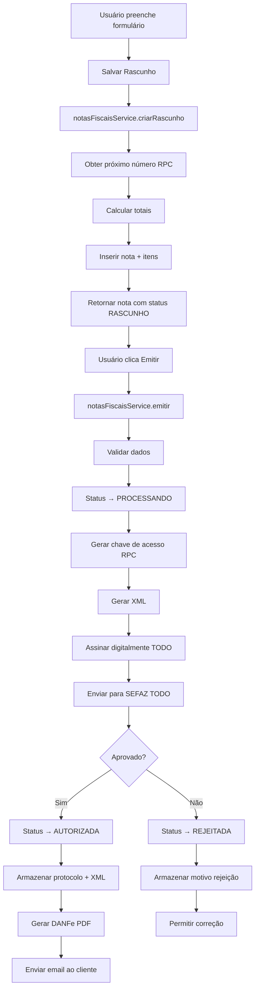

# Módulo: Notas Fiscais (NF-e/NFC-e)

**Data de Criação**: 01/12/2025  
**Status**: ✅ Implementado (Backend completo, SEFAZ em desenvolvimento)

---

## Visão Geral

Módulo completo para **emissão de notas fiscais eletrônicas** (NF-e modelo 55 e NFC-e modelo 65) seguindo padrões de ERPs profissionais como Bling, Omie, Sankhya e Totvs.

### Principais Funcionalidades

1. **Emissão de Notas Fiscais**
   - Workflow completo: Rascunho → Validação → Geração XML → Assinatura → SEFAZ → DANFe
   - Suporte a NF-e (modelo 55) e NFC-e (modelo 65)
   - Cálculo automático de impostos por item (ICMS, ST, PIS, COFINS, IPI)
   - Geração automática de chave de acesso (44 dígitos com módulo 11)
   - Controle de numeração sequencial por série e ambiente

2. **Parâmetros Fiscais**
   - Configuração de dados da empresa (CNPJ, IE, CRT, regime tributário)
   - Gerenciamento de certificado digital (A1/A3)
   - Configuração de séries e CSC (NFC-e)
   - Acesso a cadastros auxiliares

3. **Cadastros de Apoio Fiscal**
   - NCM (Nomenclatura Comum do Mercosul)
   - CFOP (Código Fiscal de Operações)
   - CEST (Código Especificador ST)
   - Operações Fiscais (regras de tributação)
   - Categorias de Produtos
   - Unidades de Medida
   - Tabela IBPT (tributos aproximados)
   - Regras ICMS/ST por UF

---

## Arquitetura

### 1. Tipos TypeScript (`types.ts`)

Define todas as interfaces e constantes do módulo:

```typescript
// Tipos principais
- NotaFiscal: Estrutura completa da NF-e/NFC-e
- NotaFiscalItem: Item individual com tributação
- NotaFiscalFormData: Dados do formulário de emissão
- NotaFiscalEvento: Eventos (cancelamento, CCe, etc)
- RetornoSEFAZ: Resposta do webservice SEFAZ
- ConfiguracaoEmissao: Configurações de ambiente

// Estados da Nota
- RASCUNHO → PROCESSANDO → AUTORIZADA/REJEITADA/DENEGADA → CANCELADA

// Constantes
- FINALIDADES_NOTA: 9 finalidades (Normal, Complementar, Ajuste, Devolução, etc)
- MODALIDADES_FRETE: 9 modalidades (Emitente, Destinatário, Terceiros, etc)
- FORMAS_PAGAMENTO: À vista / À prazo / Outros
- MEIOS_PAGAMENTO: 15 meios (Dinheiro, Cartão, PIX, Boleto, etc)
```

### 2. Database Schema

**5 Tabelas Principais:**

#### `notas_fiscais`
- **PKs**: `id` (BIGSERIAL)
- **Campos-chave**: 
  - `chave_acesso` (VARCHAR(44) UNIQUE) - Chave de 44 dígitos
  - `numero`, `serie`, `modelo`, `tipo_nota`
  - `status` (7 estados possíveis)
- **Destinatário**: CPF/CNPJ, nome, endereço completo, contatos
- **Totalizadores**: valores de produtos, frete, seguro, desconto, impostos
- **Transporte**: modalidade, transportadora, veículo, volumes
- **Pagamento**: forma, meio, valor pago, troco
- **SEFAZ**: protocolo, XML enviado/autorizado, data autorização, motivo rejeição
- **Cancelamento**: data, protocolo, justificativa
- **Contingência**: tipo, data entrada/saída, justificativa

#### `notas_fiscais_itens`
- **PKs**: `id` (BIGSERIAL), `UNIQUE(nota_fiscal_id, numero_item)`
- **Produto**: código, descrição, NCM, CEST, CFOP
- **Quantidades**: comercial e tributável (unidade, quantidade, valor unitário)
- **Tributação por item**:
  - Origem mercadoria (0-8)
  - ICMS: CST/CSOSN, modalidade BC, redução BC, alíquota, valor
  - ST: modalidade BC, MVA, redução BC, alíquota, valor
  - Desoneração ICMS: motivo, valor
  - PIS: CST, alíquota, valor
  - COFINS: CST, alíquota, valor
  - IPI: CST, enquadramento, alíquota, valor

#### `notas_fiscais_eventos`
- Histórico de eventos (CANCELAMENTO, CARTA_CORRECAO, MANIFESTACAO, EPEC)
- Controle de sequência
- XML e protocolo do evento
- Data/hora e status

#### `notas_fiscais_numeracao`
- Controle de próximo número por tipo/série/ambiente
- Pre-populated com NFE e NFCE série 1 para HOMOLOGACAO e PRODUCAO

#### `notas_fiscais_inutilizacao`
- Registro de faixas de números inutilizados
- Justificativa e protocolo

**Views:**
- `vw_notas_fiscais_resumo`: Lista com totais e contagem de itens

**Funções PostgreSQL:**
- `get_proximo_numero_nota()`: Retorna e incrementa número sequencial
- `gerar_chave_acesso_nfe()`: Gera chave de 44 dígitos com módulo 11
  - Mapeia UF para código (27 estados)
  - Calcula dígito verificador

### 3. Services (`notasFiscaisService.ts`)

Camada de serviços com todas as operações:

#### CRUD Básico
```typescript
- listar(filtros): Busca com filtros (tipo, status, datas, cliente)
- buscarPorId(id): Retorna nota com itens (JOIN)
- buscarPorChave(chave): Busca por chave de acesso
- criarRascunho(formData): Cria nota em rascunho, obtém próximo número
- atualizar(id, dados): Atualiza dados
- deletar(id): Remove nota (apenas se RASCUNHO)
```

#### Workflow de Emissão
```typescript
async emitir(id: number): Promise<RetornoSEFAZ> {
  1. Busca nota e valida status (deve ser RASCUNHO)
  2. Valida dados (validarNotaFiscal)
  3. Atualiza status para PROCESSANDO
  4. Gera chave de acesso (RPC gerar_chave_acesso_nfe)
  5. Gera XML (gerarXMLNFe)
  6. Assina digitalmente (TODO: implementar)
  7. Envia para SEFAZ (TODO: implementar webservice)
  8. Atualiza status para AUTORIZADA/REJEITADA
  9. Armazena protocolo e XML autorizado
  10. Retorna resultado
}
```

#### Funções Auxiliares
```typescript
- calcularTotaisNota(itens): Soma valores, impostos, outras despesas
- validarNotaFiscal(nota): Valida CNPJ, IE, itens, totais
- gerarXMLNFe(nota, itens): Gera XML simplificado (stub, precisa completar)
```

#### Cancelamento
```typescript
- cancelar(id, justificativa): Cria evento CANCELAMENTO, atualiza status
```

### 4. Componentes React

#### `EmitirNotaFiscal.tsx`
Interface de emissão em **5 etapas**:

**Etapa 1: Dados Gerais**
- Tipo de nota (NF-e/NFC-e)
- Série
- Finalidade
- Natureza da operação

**Etapa 2: Destinatário**
- CPF/CNPJ, nome, IE
- Endereço completo (logradouro, número, bairro, cidade, UF, CEP)
- Email para envio

**Etapa 3: Produtos**
- Formulário para adicionar itens
- Grid com itens adicionados
- Cálculo de totais em tempo real
- Campos: código, descrição, NCM, CFOP, unidade, quantidade, valor unitário

**Etapa 4: Transporte e Pagamento**
- Modalidade de frete
- Forma e meio de pagamento
- Valor pago
- Informações complementares

**Etapa 5: Revisão**
- Resumo de todos os dados
- Botão "Emitir Nota Fiscal"
- Indicador de carregamento

**Features:**
- Navegação entre etapas com validação
- Toasts de sucesso/erro
- Loading states
- Resetar formulário após emissão

#### `ParametrosFiscais.tsx`
Tela de configuração em **4 abas**:

**Aba 1: Dados da Empresa**
- CNPJ, IE, UF, código IBGE município
- Regime tributário e CRT
- Ambiente (homologação/produção)

**Aba 2: Certificado Digital**
- Upload de certificado A1 (.pfx/.p12)
- Input de senha (não armazenada)
- Validação de certificado

**Aba 3: Numeração**
- Configuração de série NF-e e NFC-e
- Visualização de próximo número (automático)
- CSC para NFC-e (homologação e produção)

**Aba 4: Cadastros Auxiliares**
- Cards com links para cada cadastro:
  - NCM, CFOP, CEST
  - Operações Fiscais
  - Categorias de Produtos
  - Unidades de Medida
  - Tabela IBPT
  - Regras ICMS/ST

---

## Refatoração da Tabela Produtos

### ANTES (Estrutura Monolítica)
A tabela `produtos` tinha **25+ campos fiscais embedded**:
```sql
- ncm, cest
- cfop_venda_dentro_estado, cfop_venda_fora_estado, cfop_devolucao
- origem_mercadoria
- cst_icms, csosn_icms, modalidade_bc_icms, aliquota_icms, reducao_bc_icms
- cst_icms_st, modalidade_bc_st, mva_st, reducao_bc_st, aliquota_st
- cst_pis, aliquota_pis
- cst_cofins, aliquota_cofins
- cst_ipi, aliquota_ipi, enquadramento_ipi
- calcula_st
- categoria (TEXT)
- unidade (TEXT)
```

### DEPOIS (Estrutura Normalizada)
Tabela `produtos` agora tem apenas **4 FKs**:
```sql
- ncm_id → ncm_cadastro
- categoria_id → categorias_produtos
- unidade_medida_id → unidades_medida
- operacao_fiscal_id → operacoes_fiscais
```

### Benefícios
✅ Eliminou redundância de 25+ campos  
✅ Regras fiscais centralizadas em `operacoes_fiscais`  
✅ Facilita manutenção e auditoria  
✅ View `vw_produtos_completo` expande dados automaticamente  
✅ Funções `get_cfop_produto()` e `calcular_impostos_produto()` aplicam regras

---

## Cadastros Auxiliares Criados

### 1. `ncm_cadastro`
- **Campos**: codigo (8 dígitos), descricao, unidade_tributavel
- **Pre-populated**: Vazio (deve ser importado da tabela oficial NCM)
- **Uso**: Classificação fiscal de produtos

### 2. `cest_cadastro`
- **Campos**: codigo (7 dígitos), descricao, ncm_id (FK)
- **Pre-populated**: Vazio (deve ser importado)
- **Uso**: Produtos sujeitos a ST

### 3. `unidades_medida`
- **Campos**: sigla (UN, CX, KG, etc), descricao, tipo
- **Pre-populated**: 15 unidades (UN, CX, PC, KG, L, M, M2, M3, TON, etc)
- **Uso**: Unidades comerciais e tributáveis

### 4. `cfop_cadastro`
- **Campos**: codigo (4 dígitos), descricao, tipo_operacao (ENTRADA/SAIDA)
- **Pre-populated**: 19 CFOPs principais (5101, 5102, 6102, 1102, 2102, etc)
- **Uso**: Natureza da operação fiscal

### 5. `categorias_produtos`
- **Campos**: nome, descricao, ncm_padrao_id
- **Pre-populated**: Vazio
- **Uso**: Agrupamento de produtos

### 6. `operacoes_fiscais`
Define **regras completas de tributação** por tipo de operação:
- **Campos**:
  - nome (Venda Consumidor Final, Revenda, Industrialização, etc)
  - tipo (VENDA, COMPRA, DEVOLUCAO, etc)
  - cfop_dentro_estado, cfop_fora_estado
  - Regras ICMS: origem, CST/CSOSN, modalidade BC, alíquota, redução
  - Calcula ST: flag + modalidade BC, MVA, redução, alíquota
  - Regras PIS: CST, alíquota
  - Regras COFINS: CST, alíquota
  - Regras IPI: CST, enquadramento, alíquota
- **Pre-populated**: Vazio (criar operações padrão)

### 7. `regras_icms_uf`
- **Campos**: uf_origem, uf_destino, aliquota_interna, aliquota_interestadual, mva_st
- **Pre-populated**: Vazio (importar alíquotas por estado)
- **Uso**: DIFAL e ST interestadual

### 8. `tabela_ibpt`
- **Campos**: ncm_id, tipo_produto, aliquota_federal, aliquota_estadual, aliquota_municipal, vigencia
- **Pre-populated**: Vazio (importar CSV do IBPT)
- **Uso**: Tributos aproximados (Lei da Transparência)

### 9. `certificados_digitais`
- **Campos**: tipo (A1/A3), arquivo_pfx (bytea), senha (encrypted), validade, cnpj_titular
- **Pre-populated**: Vazio
- **Uso**: Assinatura digital de XML

### 10. `parametros_fiscais`
- **Campos**: CNPJ, IE, CRT, regime, UF, município, séries, CSC, ambiente
- **Pre-populated**: Vazio (configurar na tela Parâmetros)
- **Uso**: Dados do emitente

---

## Fluxo Completo de Emissão



---

## Pendências de Implementação

### 1. Assinatura Digital ⏳
**Status**: Stub implementado, precisa completar  
**Dependências**: 
- Biblioteca de criptografia (crypto-browserify ou node-forge)
- Leitura de certificado .pfx
- Assinatura XML com X.509

**Implementação sugerida**:
```typescript
import forge from 'node-forge'

async function assinarXML(xml: string, certificado: Buffer, senha: string) {
  const p12 = forge.pkcs12.fromAsn1(...)
  const privateKey = p12.getBags({ bagType: forge.pki.oids.pkcs8ShroudedKeyBag })
  // Assinar nó <infNFe> com SHA256
  // Adicionar tag <Signature> ao XML
}
```

### 2. Integração SEFAZ ⏳
**Status**: Simulação implementada, precisa webservice real  
**Dependências**:
- URLs dos webservices por UF e ambiente
- Cliente SOAP (soap ou axios)
- Tratamento de respostas (protocolo, rejeições, contingência)

**Webservices necessários**:
- NFeAutorizacao: Envio de lote
- NFeRetAutorizacao: Consulta protocolo
- NFeConsultaProtocolo: Consulta nota autorizada
- NFeInutilizacao: Inutilização de números
- NFeStatusServico: Status do serviço
- RecepcaoEvento: Cancelamento, CCe

**URLs por ambiente** (exemplo SP):
```
HOMOLOGACAO: https://homologacao.nfe.fazenda.sp.gov.br/ws/nfeautorizacao4.asmx
PRODUCAO: https://nfe.fazenda.sp.gov.br/ws/nfeautorizacao4.asmx
```

### 3. Geração de DANFe 📄
**Status**: Não implementado  
**Sugestão**: Biblioteca `pdfmake` ou `jspdf`  
**Layout**: Modelo DANFE Retrato/Paisagem conforme SEFAZ

### 4. QR Code NFC-e 📱
**Status**: Não implementado  
**Dependência**: CSC configurado  
**Biblioteca**: `qrcode`  
**Fórmula**: Hash SHA-1 de chave + CSC

### 5. Importação de Tabelas 📊
Criar telas para importar:
- NCM completa (CSV oficial)
- CEST completa (CSV CONFAZ)
- Tabela IBPT (CSV trimestral)
- Alíquotas ICMS por UF (manual ou CSV)

### 6. Consulta de Notas Emitidas 📋
Criar tela de listagem com:
- Grid com filtros (data, status, cliente, chave)
- Ações: Visualizar XML, Download DANFe, Enviar Email, Cancelar, CCe

### 7. Contingência ⚠️
Implementar emissão em contingência:
- FS-IA (Formulário de Segurança)
- EPEC (Evento Prévio de Emissão em Contingência)
- SVC (Sefaz Virtual de Contingência)

---

## Rotas do Módulo

```typescript
// App.tsx
<Route path="notas-fiscais/emitir" element={<EmitirNotaFiscal />} />
<Route path="notas-fiscais/parametros" element={<ParametrosFiscais />} />
```

## Menu do Sistema

```typescript
// Layout.tsx - Menu "Notas Fiscais"
- Emitir Nota Fiscal (/notas-fiscais/emitir)
- Parâmetros Fiscais (/notas-fiscais/parametros)
```

---

## Tecnologias Utilizadas

- **Frontend**: React + TypeScript + TailwindCSS
- **Backend**: Supabase PostgreSQL
- **Validações**: TypeScript strict mode
- **RLS**: Políticas por usuário autenticado
- **Triggers**: updated_at automático

---

## Exemplos de Uso

### Criar nota em rascunho
```typescript
const formData: NotaFiscalFormData = {
  tipo_nota: 'NFE',
  serie: 1,
  natureza_operacao: 'Venda de mercadoria',
  finalidade: '1',
  destinatario_cpf_cnpj: '12345678901',
  destinatario_nome: 'Cliente Teste',
  itens: [{
    codigo_produto: 'PROD001',
    descricao: 'Produto Teste',
    ncm: '12345678',
    cfop: '5102',
    unidade_comercial: 'UN',
    quantidade_comercial: 10,
    valor_unitario_comercial: 100
  }]
}

const nota = await notasFiscaisService.criarRascunho(formData)
```

### Emitir nota
```typescript
const resultado = await notasFiscaisService.emitir(nota.id)

if (resultado.sucesso) {
  console.log('Autorizada:', resultado.chave_acesso, resultado.protocolo)
} else {
  console.error('Rejeitada:', resultado.mensagem)
}
```

### Cancelar nota
```typescript
await notasFiscaisService.cancelar(nota.id, 'Erro no preenchimento')
```

---

## Testes Necessários

- [ ] Emissão em homologação com certificado de teste
- [ ] Validação de chave de acesso (módulo 11)
- [ ] Cálculo de impostos com diferentes CSTs
- [ ] Contingência FS-IA e EPEC
- [ ] Cancelamento dentro de 24h
- [ ] Carta de Correção (CCe)
- [ ] Inutilização de numeração
- [ ] Geração de DANFe PDF
- [ ] QR Code NFC-e
- [ ] Envio de email com XML e PDF

---

## Referências

- **Manual de Integração NF-e**: [Portal NF-e](http://www.nfe.fazenda.gov.br/portal/principal.aspx)
- **Schemas XML**: Versão 4.00
- **Tabelas Oficiais**: NCM, CFOP, CST (Receita Federal)
- **CEST**: [Portal CONFAZ](https://www.confaz.fazenda.gov.br/)
- **Tabela IBPT**: [https://ibpt.com.br/](https://ibpt.com.br/)

---

**Desenvolvido em**: 01/12/2025  
**Autor**: Sistema de Inventário e Cadastro  
**Versão**: 1.0.0
