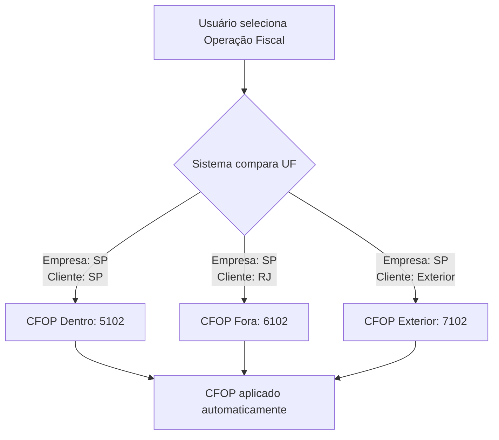

# 🎯 SELEÇÃO AUTOMÁTICA DE CFOP POR UF

**Data:** 26/01/2026  
**Status:** ✅ Implementado

---

## 📋 O QUE FOI IMPLEMENTADO

O sistema agora **compara automaticamente** o estado (UF) da **empresa emissora** com o estado do **cliente destinatário** e escolhe o CFOP correto.

---

## 🔍 COMO FUNCIONA

### Fluxo Automático



### Regras de Seleção

| Situação | UF Empresa | UF Cliente | CFOP Escolhido | Exemplo |
|----------|------------|------------|----------------|---------|
| **Dentro do Estado** | SP | SP | `cfop_dentro_estado` | 5102 |
| **Fora do Estado** | SP | RJ | `cfop_fora_estado` | 6102 |
| **Exterior** | SP | - | `cfop_exterior` | 7102 |

---

## 💻 EXEMPLO PRÁTICO

### Cenário 1: Venda Dentro do Estado

**Dados:**
- Empresa: São Paulo (SP)
- Cliente: São Paulo (SP)
- Operação: VENDA001 - Venda de Mercadoria

**Resultado:**
```
UF Empresa: SP
UF Cliente: SP
✅ CFOP: 5102 (dentro do estado)
```

### Cenário 2: Venda Fora do Estado

**Dados:**
- Empresa: São Paulo (SP)
- Cliente: Rio de Janeiro (RJ)
- Operação: VENDA001 - Venda de Mercadoria

**Resultado:**
```
UF Empresa: SP
UF Cliente: RJ
✅ CFOP: 6102 (fora do estado)
```

### Cenário 3: Transferência Entre Filiais

**Dados:**
- Empresa: São Paulo (SP)
- Cliente: Minas Gerais (MG)
- Operação: TRANSF001 - Transferência entre Filiais

**Resultado:**
```
UF Empresa: SP
UF Cliente: MG
✅ CFOP: 6152 (transferência fora do estado)
```

---

## 🔄 QUANDO O CFOP É ATUALIZADO

### 1. **Ao Selecionar Operação Fiscal**
Quando o usuário seleciona uma operação no dropdown, o sistema:
1. Lê a UF da empresa emissora
2. Lê a UF do cliente (se já preenchida)
3. Compara as UFs
4. Escolhe o CFOP apropriado
5. Aplica em todos os itens

### 2. **Ao Alterar UF do Cliente**
Quando o usuário muda a UF do cliente:
1. Sistema detecta a mudança
2. Recalcula o CFOP automaticamente
3. Atualiza todos os itens da nota

---

## 📊 ESTRUTURA DO CADASTRO

### Tabela: `operacoes_fiscais`

Cada operação fiscal tem 3 CFOPs cadastrados:

```sql
CREATE TABLE operacoes_fiscais (
    ...
    cfop_dentro_estado VARCHAR(4),  -- Ex: 5102 (UF igual)
    cfop_fora_estado VARCHAR(4),    -- Ex: 6102 (UF diferente)
    cfop_exterior VARCHAR(4),       -- Ex: 7102 (Exterior)
    ...
);
```

### Exemplo de Registro:

| codigo | nome | cfop_dentro | cfop_fora | cfop_exterior |
|--------|------|-------------|-----------|---------------|
| VENDA001 | Venda de Mercadoria | 5102 | 6102 | 7102 |
| TRANSF001 | Transferência | 5152 | 6152 | NULL |
| DEVOL001 | Devolução | 5202 | 6202 | 7202 |

---

## 🎨 INTERFACE DO USUÁRIO

### Antes:
```
┌─────────────────────────────────────┐
│ Operação: [VENDA001]                │
│ Natureza: Venda de mercadoria       │
│ CFOP: [____]  ← Usuário digitava   │
└─────────────────────────────────────┘
```

### Agora:
```
┌────────────────────────────────────────────────┐
│ Operação: [VENDA001 - Venda de Mercadoria]    │
│ Natureza: Venda de mercadoria                  │
│ 🔍 CFOP Automático:                            │
│    Empresa: SP                                 │
│    Cliente: RJ                                 │
│    CFOP Escolhido: 6102 (fora do estado)      │
│                                                │
│ CFOP nos Itens: 6102 ✅                        │
└────────────────────────────────────────────────┘
```

---

## 🔧 IMPLEMENTAÇÃO TÉCNICA

### Função: `selecionarCFOPAutomatico(operacao)`

```typescript
const selecionarCFOPAutomatico = (operacao: OperacaoFiscal) => {
  const ufEmpresa = empresaSelecionada?.estado?.toUpperCase()
  const ufCliente = formData.destinatario_uf?.toUpperCase()
  
  if (!ufEmpresa) {
    console.warn('⚠️ UF da empresa não definida')
    return
  }

  let cfopSelecionado = ''
  let origem = ''

  // Comparar UF e escolher CFOP
  if (ufCliente === ufEmpresa) {
    cfopSelecionado = operacao.cfop_dentro_estado || ''
    origem = 'dentro do estado'
  } else if (ufCliente && ufCliente.length === 2) {
    cfopSelecionado = operacao.cfop_fora_estado || ''
    origem = 'fora do estado'
  } else if (operacao.cfop_exterior) {
    cfopSelecionado = operacao.cfop_exterior
    origem = 'exterior'
  } else {
    cfopSelecionado = operacao.cfop_dentro_estado || ''
    origem = 'padrão (dentro do estado)'
  }

  // Aplicar em todos os itens
  setFormData(prev => ({
    ...prev,
    itens: prev.itens.map(item => ({ ...item, cfop: cfopSelecionado }))
  }))

  // Aplicar em novos itens
  setItemAtual(prev => ({ ...prev, cfop: cfopSelecionado }))
}
```

### useEffect para Recalcular:

```typescript
useEffect(() => {
  if (operacaoSelecionada && formData.destinatario_uf && empresaSelecionada) {
    console.log('🔄 UF do cliente alterada, recalculando CFOP...')
    selecionarCFOPAutomatico(operacaoSelecionada)
  }
}, [formData.destinatario_uf])
```

---

## ✅ VALIDAÇÕES

### Validação 1: UF da Empresa
```typescript
if (!ufEmpresa) {
  console.warn('⚠️ UF da empresa não definida')
  return // Não consegue determinar CFOP
}
```

### Validação 2: UF do Cliente
```typescript
if (ufCliente && ufCliente.length === 2) {
  // UF válida, compara com empresa
} else {
  // UF inválida ou não informada, usa padrão
}
```

---

## 🎯 BENEFÍCIOS

### Para o Usuário:
✅ **Automático** - Não precisa saber qual CFOP usar  
✅ **Sem erros** - Sistema escolhe o correto sempre  
✅ **Rápido** - Troca instantânea ao mudar UF  
✅ **Transparente** - Mostra no console qual foi escolhido  

### Para a Empresa:
✅ **Compliance** - CFOPs sempre corretos por UF  
✅ **Auditoria** - Logs de qual CFOP foi aplicado  
✅ **Menos rejeições** - CFOP adequado ao destino  
✅ **Padronização** - Todos seguem a mesma regra  

---

## 📝 LOGS DO SISTEMA

Quando uma operação é selecionada, o sistema gera logs:

```
🔍 CFOP Automático:
   Empresa: SP
   Cliente: RJ
   CFOP Escolhido: 6102 (fora do estado)
```

Quando a UF do cliente muda:

```
🔄 UF do cliente alterada, recalculando CFOP...
🔍 CFOP Automático:
   Empresa: SP
   Cliente: MG
   CFOP Escolhido: 6102 (fora do estado)
```

---

## ⚠️ CASOS ESPECIAIS

### Caso 1: Cliente sem UF
Se o cliente não tiver UF preenchida:
- Sistema usa `cfop_dentro_estado` como padrão
- Ao preencher a UF depois, recalcula automaticamente

### Caso 2: Exterior
Se a UF não for brasileira ou estiver em branco e a operação tiver `cfop_exterior`:
- Sistema usa o CFOP de exterior (7xxx ou 3xxx)

### Caso 3: Operação sem CFOP Fora do Estado
Se a operação não tiver `cfop_fora_estado` cadastrado:
- Sistema usa `cfop_dentro_estado` como fallback
- Gera aviso no console

---

## 🔄 FLUXO COMPLETO

```
1. Usuário acessa "Emitir Nota Fiscal"
2. Seleciona Empresa (SP)
3. Seleciona Cliente (RJ)
4. Sistema detecta: UF diferente
5. Usuário seleciona Operação: VENDA001
6. Sistema busca:
   - cfop_dentro_estado: 5102
   - cfop_fora_estado: 6102
7. Sistema compara: SP ≠ RJ
8. Sistema escolhe: 6102 (fora do estado)
9. Aplica CFOP em todos os itens
10. ✅ Nota pronta para emissão
```

---

## 📂 ARQUIVOS MODIFICADOS

1. **[EmitirNotaFiscal.tsx](src/features/notas-fiscais/EmitirNotaFiscal.tsx)**
   - Função `selecionarCFOPAutomatico()` (linha ~310)
   - useEffect para recalcular ao mudar UF (linha ~143)
   - Chamada na seleção de operação (linha ~848)

---

## ✅ TESTE RÁPIDO

Para testar:

1. Acesse **Emitir Nota Fiscal**
2. Selecione uma empresa de São Paulo (SP)
3. Selecione um cliente do Rio de Janeiro (RJ)
4. Escolha operação: **VENDA001 - Venda de Mercadoria**
5. Verifique o console do navegador (F12)
6. Deve aparecer: `CFOP Escolhido: 6102 (fora do estado)`

---

**✅ Sistema agora escolhe o CFOP correto automaticamente baseado na UF!**
