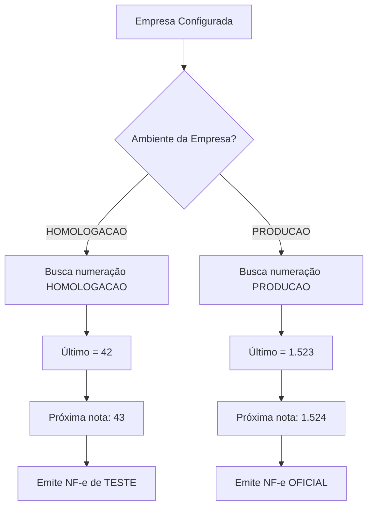

# 🔢 CONTROLE DE NUMERAÇÃO - PRODUÇÃO E HOMOLOGAÇÃO

**Data:** 26/01/2026  
**Status:** ✅ Implementado e Corrigido

---

## 📋 VISÃO GERAL

O sistema mantém **numeração separada** para:
- **Produção (PRODUCAO):** Notas fiscais oficiais com valor fiscal
- **Homologação (HOMOLOGACAO):** Notas de teste sem valor fiscal

Cada ambiente tem sua própria sequência numérica independente.

---

## 🗄️ ESTRUTURA DO BANCO DE DADOS

### Tabela: `notas_fiscais_numeracao`

```sql
CREATE TABLE notas_fiscais_numeracao (
    id BIGSERIAL PRIMARY KEY,
    tipo_nota VARCHAR(10) NOT NULL,        -- 'NFE' ou 'NFCE'
    serie INTEGER NOT NULL,                -- Série da nota
    ultimo_numero INTEGER NOT NULL DEFAULT 0,
    ambiente VARCHAR(15) NOT NULL,         -- 'PRODUCAO' ou 'HOMOLOGACAO'
    ativo BOOLEAN DEFAULT true,            -- Automático/Manual
    created_at TIMESTAMPTZ DEFAULT NOW(),
    updated_at TIMESTAMPTZ DEFAULT NOW(),
    UNIQUE(tipo_nota, serie, ambiente)
);
```

### Registros Padrão

O sistema cria automaticamente 4 registros de controle:

| tipo_nota | serie | ambiente     | ultimo_numero | ativo |
|-----------|-------|--------------|---------------|-------|
| NFE       | 1     | HOMOLOGACAO  | 0             | true  |
| NFCE      | 1     | HOMOLOGACAO  | 0             | true  |
| NFE       | 1     | PRODUCAO     | 0             | true  |
| NFCE      | 1     | PRODUCAO     | 0             | true  |

---

## 🎯 COMO FUNCIONA

### 1. Configuração do Ambiente

**Cadastro de Empresas** ([CadastroEmpresa.tsx](src/features/empresa/CadastroEmpresa.tsx))

```tsx
<select name="ambiente_nfe" value={formData.ambiente_nfe}>
  <option value="HOMOLOGACAO">🟡 Homologação (Testes)</option>
  <option value="PRODUCAO">🟢 Produção (Notas Reais)</option>
</select>
```

Cada empresa tem seu **próprio ambiente** configurado no campo `ambiente_nfe`.

### 2. Numeração por Ambiente

**Quando a empresa está em HOMOLOGAÇÃO:**
- Sistema busca: `WHERE tipo_nota='NFE' AND ambiente='HOMOLOGACAO'`
- Próxima nota: `ultimo_numero + 1`
- Notas emitidas: **SEM valor fiscal**

**Quando a empresa está em PRODUÇÃO:**
- Sistema busca: `WHERE tipo_nota='NFE' AND ambiente='PRODUCAO'`
- Próxima nota: `ultimo_numero + 1`
- Notas emitidas: **COM valor fiscal oficial**

### 3. Tela de Parâmetros Fiscais

**Exibe numeração conforme ambiente da empresa selecionada:**

```typescript
// Ao selecionar empresa, carrega numeração do ambiente dela
useEffect(() => {
  if (empresaSelecionada) {
    carregarNumeracao(empresaSelecionada.ambiente_nfe || 'HOMOLOGACAO')
  }
}, [empresaSelecionada])

const carregarNumeracao = async (ambiente: 'PRODUCAO' | 'HOMOLOGACAO') => {
  const { data } = await supabase
    .from('notas_fiscais_numeracao')
    .select('*')
    .eq('tipo_nota', 'NFE')
    .eq('ambiente', ambiente)  // ✅ Filtra por ambiente
}
```

---

## 🔄 FLUXO COMPLETO



---

## 📊 EXEMPLOS PRÁTICOS

### Exemplo 1: Migração de Sistema

**Situação:** Empresa já emitiu 1.500 notas em outro sistema e vai migrar para produção.

**Passo a passo:**
1. Cadastrar empresa com `ambiente_nfe = 'PRODUCAO'`
2. Acessar **Parâmetros Fiscais > Numeração**
3. Sistema mostra numeração de PRODUÇÃO (começa em 0)
4. Desativar modo automático (toggle manual)
5. Alterar "Último Número Emitido" para **1500**
6. Salvar
7. Próxima nota será **1501** em PRODUÇÃO

### Exemplo 2: Testes em Homologação

**Situação:** Empresa quer testar emissão antes de ir para produção.

**Passo a passo:**
1. Empresa configurada com `ambiente_nfe = 'HOMOLOGACAO'`
2. Emitir 10 notas de teste
3. Numeração HOMOLOGACAO: 1, 2, 3... 10
4. Quando estiver pronto, alterar empresa para `ambiente_nfe = 'PRODUCAO'`
5. Numeração PRODUCAO começa do zero: 1, 2, 3...
6. **As 10 notas de teste NÃO interferem na numeração oficial!**

### Exemplo 3: Empresa com Dois Ambientes

**Situação:** Empresa quer manter ambiente de teste sempre ativo.

**Solução:** Cadastrar 2 empresas com mesmo CNPJ:
- **Empresa A:** `ambiente_nfe = 'HOMOLOGACAO'` (para testes)
- **Empresa B:** `ambiente_nfe = 'PRODUCAO'` (para oficial)

Cada uma terá sua própria numeração independente.

---

## ⚙️ CONTROLE AUTOMÁTICO vs MANUAL

### Modo Automático (ativo = true)
- ✅ Sistema incrementa automaticamente
- ✅ Campo "Último Número" desabilitado
- ✅ Seguro para operação normal
- ✅ **Recomendado para uso diário**

### Modo Manual (ativo = false)
- ✅ Permite editar o último número
- ✅ Útil para migração
- ✅ Correção de problemas
- ⚠️ **Usar com cuidado**

---

## 📂 ARQUIVOS RELACIONADOS

1. **[CadastroEmpresa.tsx](src/features/empresa/CadastroEmpresa.tsx)**
   - Campo `ambiente_nfe` no formulário
   - Linha ~954: Select de ambiente

2. **[ParametrosFiscais.tsx](src/features/notas-fiscais/ParametrosFiscais.tsx)**
   - Função `carregarNumeracao(ambiente)`
   - Função `salvarNumeracao()` com ambiente dinâmico
   - Linha ~90: useEffect que carrega baseado no ambiente

3. **[CRIAR_CONTROLE_NUMERACAO_NFE.sql](database/CRIAR_CONTROLE_NUMERACAO_NFE.sql)**
   - Script de criação da tabela
   - Inserção dos registros iniciais
   - Dados para ambos os ambientes

---

## ⚠️ ATENÇÕES IMPORTANTES

### 🚨 Nunca misture ambientes!
- Numeração de HOMOLOGACAO não afeta PRODUCAO
- Numeração de PRODUCAO não afeta HOMOLOGACAO
- São sequências **completamente independentes**

### 🚨 Validação de Ambiente
- Sempre verificar `ambiente_nfe` da empresa antes de emitir
- HOMOLOGACAO: Notas sem valor fiscal (para testes)
- PRODUCAO: Notas oficiais enviadas à SEFAZ

### 🚨 Migração para Produção
- Ajustar numeração ANTES de emitir primeira nota oficial
- Usar modo manual temporariamente
- Voltar para modo automático após ajuste

---

## 🔍 CONSULTAS SQL ÚTEIS

### Ver numeração de todos os ambientes
```sql
SELECT 
  tipo_nota,
  serie,
  ambiente,
  ultimo_numero,
  CASE WHEN ativo THEN 'Automático' ELSE 'Manual' END as controle
FROM notas_fiscais_numeracao
ORDER BY ambiente, tipo_nota;
```

### Ajustar numeração para migração
```sql
-- Exemplo: Empresa já tinha 2.500 notas emitidas
UPDATE notas_fiscais_numeracao
SET ultimo_numero = 2500
WHERE tipo_nota = 'NFE' 
  AND serie = 1
  AND ambiente = 'PRODUCAO';
```

### Verificar ambiente de uma empresa
```sql
SELECT 
  id,
  nome_fantasia,
  cnpj,
  ambiente_nfe,
  CASE 
    WHEN ambiente_nfe = 'PRODUCAO' THEN '🟢 Produção'
    WHEN ambiente_nfe = 'HOMOLOGACAO' THEN '🟡 Homologação'
    ELSE '⚪ Não configurado'
  END as status_ambiente
FROM empresas
WHERE emite_nfe = true;
```

---

## ✅ CHECKLIST DE CONFIGURAÇÃO

Para começar a emitir notas fiscais:

- [ ] Executar [CRIAR_CONTROLE_NUMERACAO_NFE.sql](database/CRIAR_CONTROLE_NUMERACAO_NFE.sql)
- [ ] Verificar se tabela `notas_fiscais_numeracao` foi criada
- [ ] Verificar se existem 4 registros (2 HOMOLOGACAO + 2 PRODUCAO)
- [ ] Configurar campo `ambiente_nfe` na empresa (Cadastro de Empresas)
- [ ] Se migração, ajustar numeração de PRODUCAO no Parâmetros Fiscais
- [ ] Testar emissão em HOMOLOGACAO primeiro
- [ ] Quando aprovado, mudar empresa para PRODUCAO

---

**✅ Sistema pronto para controlar numeração em ambos os ambientes!**
