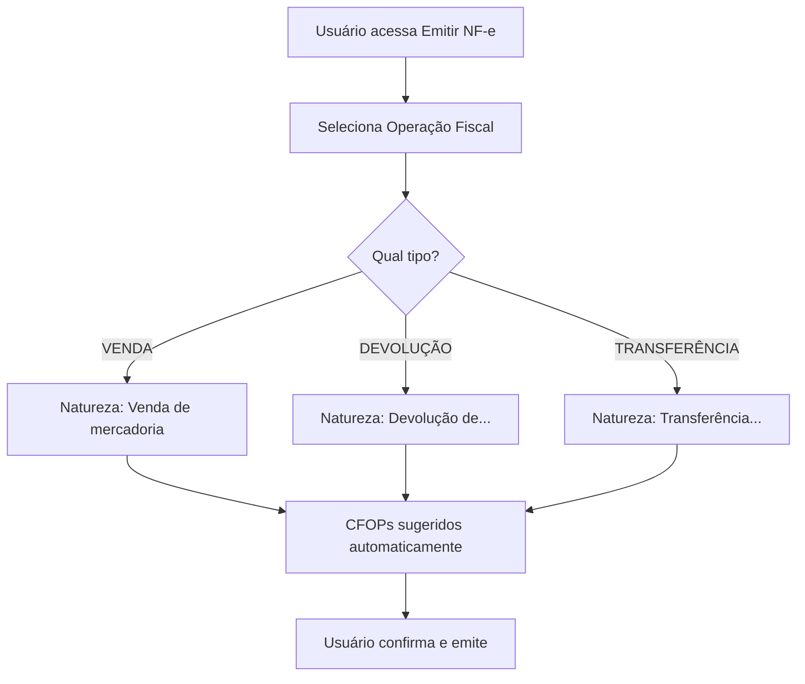

# 📋 CONTROLE DE OPERAÇÕES FISCAIS E NATUREZA DA OPERAÇÃO

**Data:** 26/01/2026  
**Status:** ✅ Implementado

---

## 🎯 PROBLEMA RESOLVIDO

### ❌ **Antes:**
- Campo "Natureza da Operação" era **texto livre**
- Usuário precisava digitar manualmente (ex: "Venda de mercadoria")
- Sem controle sobre tipo de operação
- Sem padronização
- Propenso a erros de digitação
- Impossível identificar se era venda, devolução, entrada, etc.

### ✅ **Agora:**
- Campo "Operação Fiscal" é um **select com cadastro**
- Lista operações pré-cadastradas
- Natureza da operação preenchida automaticamente
- Identifica tipo de operação (VENDA, DEVOLUÇÃO, TRANSFERÊNCIA, etc.)
- CFOPs sugeridos automaticamente
- Padronização total

---

## 🗄️ ESTRUTURA

### Tabela: `operacoes_fiscais`

```sql
CREATE TABLE operacoes_fiscais (
    id BIGSERIAL PRIMARY KEY,
    codigo VARCHAR(20) UNIQUE NOT NULL,          -- Ex: VENDA001
    nome VARCHAR(100) NOT NULL,                  -- Ex: Venda de Mercadoria
    descricao TEXT,                              -- Descrição detalhada
    tipo_operacao VARCHAR(30) NOT NULL,          -- VENDA, COMPRA, DEVOLUCAO, etc.
    finalidade VARCHAR(10) NOT NULL,             -- ENTRADA ou SAIDA
    natureza_operacao VARCHAR(100) NOT NULL,     -- "Venda de mercadoria"
    cfop_dentro_estado VARCHAR(4),               -- 5102
    cfop_fora_estado VARCHAR(4),                 -- 6102
    cfop_exterior VARCHAR(4),                    -- 7102
    regime_tributario VARCHAR(20),               -- SIMPLES, PRESUMIDO, REAL, TODOS
    calcular_icms BOOLEAN DEFAULT true,
    calcular_ipi BOOLEAN DEFAULT true,
    calcular_pis BOOLEAN DEFAULT true,
    calcular_cofins BOOLEAN DEFAULT true,
    calcular_st BOOLEAN DEFAULT false,
    ativo BOOLEAN DEFAULT true,
    created_at TIMESTAMPTZ DEFAULT NOW(),
    updated_at TIMESTAMPTZ DEFAULT NOW()
);
```

---

## 📊 TIPOS DE OPERAÇÃO

### 1. VENDA 🛒
Operações de saída de mercadoria com transferência de propriedade.

| Código | Nome | Natureza | CFOP Dentro | CFOP Fora |
|--------|------|----------|-------------|-----------|
| VENDA001 | Venda de Mercadoria | Venda de mercadoria | 5102 | 6102 |
| VENDA002 | Venda de Produção Própria | Venda de produção do estabelecimento | 5101 | 6101 |
| VENDA003 | Venda com ST | Venda com substituição tributária | 5405 | 6404 |
| VENDA004 | Venda Consumidor Final | Venda a consumidor final | 5102 | 6108 |

**Quando usar:**
- Venda normal ao cliente
- Emissão de NF-e de saída
- Transferência de propriedade
- Gera receita

---

### 2. COMPRA 🛍️
Operações de entrada de mercadoria por aquisição.

| Código | Nome | Natureza | CFOP Dentro | CFOP Fora |
|--------|------|----------|-------------|-----------|
| COMPRA001 | Compra para Comercialização | Compra para comercialização | 1102 | 2102 |
| COMPRA002 | Compra para Industrialização | Compra para industrialização | 1101 | 2101 |

**Quando usar:**
- Aquisição de mercadoria para revenda
- Compra de matéria-prima
- Entrada no estoque
- Gera custo

---

### 3. DEVOLUÇÃO 🔄
Operações de retorno de mercadoria ao remetente original.

| Código | Nome | Natureza | CFOP Dentro | CFOP Fora |
|--------|------|----------|-------------|-----------|
| DEVOL001 | Devolução de Compra | Devolução de compra de mercadoria | 5202 | 6202 |
| DEVOL002 | Devolução de Venda | Devolução de venda de mercadoria | 1202 | 2202 |

**Quando usar:**
- Cliente devolveu mercadoria vendida
- Fornecedor aceitou devolução de compra
- Produto com defeito
- Estorno de operação

---

### 4. TRANSFERÊNCIA 🔀
Movimentação entre estabelecimentos da mesma empresa.

| Código | Nome | Natureza | CFOP Dentro | CFOP Fora |
|--------|------|----------|-------------|-----------|
| TRANSF001 | Transferência entre Filiais | Transferência de mercadoria | 5152 | 6152 |

**Quando usar:**
- Movimentação entre matriz e filial
- Transferência entre filiais
- Mesma empresa (mesmo CNPJ raiz)
- Não gera receita/custo

---

### 5. REMESSA 📦
Envio temporário sem transferência de propriedade.

| Código | Nome | Natureza | CFOP Dentro | CFOP Fora |
|--------|------|----------|-------------|-----------|
| REMESSA001 | Remessa para Conserto | Remessa para conserto | 5915 | 6915 |
| REMESSA002 | Remessa em Comodato | Remessa em comodato | 5908 | 6908 |

**Quando usar:**
- Envio para reparo/manutenção
- Empréstimo de equipamento
- Demonstração de produto
- Mercadoria volta depois

---

### 6. RETORNO ⏪
Volta de mercadoria remetida temporariamente.

| Código | Nome | Natureza | CFOP Dentro | CFOP Fora |
|--------|------|----------|-------------|-----------|
| RETORNO001 | Retorno de Conserto | Retorno de conserto | 1916 | 2916 |
| RETORNO002 | Retorno de Comodato | Retorno de comodato | 1909 | 2909 |

**Quando usar:**
- Volta de mercadoria enviada para conserto
- Devolução de comodato/empréstimo
- Complemento da operação de remessa

---

### 7. BONIFICAÇÃO 🎁
Saída gratuita ou doação.

| Código | Nome | Natureza | CFOP Dentro | CFOP Fora |
|--------|------|----------|-------------|-----------|
| BONIF001 | Bonificação/Doação/Brinde | Bonificação/Doação | 5910 | 6910 |

**Quando usar:**
- Brindes promocionais
- Doações
- Amostras grátis
- Sem cobrança ao destinatário

---

### 8. OUTRAS 📝
Operações especiais/específicas.

| Código | Nome | Natureza | CFOP Dentro | CFOP Fora |
|--------|------|----------|-------------|-----------|
| OUTRAS001 | Simples Remessa | Simples remessa | 5949 | 6949 |
| OUTRAS002 | Ajuste de Estoque | Ajuste de estoque | 5927 | 6927 |

---

## 🔄 FLUXO NA EMISSÃO DE NF-e



---

## 💻 INTERFACE

### Tela: Emitir Nota Fiscal

**Antes:**
```
┌─────────────────────────────────────┐
│ Natureza da Operação *              │
│ [________________________] <-- texto│
└─────────────────────────────────────┘
```

**Agora:**
```
┌────────────────────────────────────────────────────────────────┐
│ Operação Fiscal / Natureza da Operação *                       │
│ [▼ VENDA001 - Venda de Mercadoria (VENDA)              ]       │
│ 📝 Natureza: Venda de mercadoria                               │
└────────────────────────────────────────────────────────────────┘
```

**Opções do select:**
- VENDA001 - Venda de Mercadoria (VENDA)
- VENDA002 - Venda de Produção Própria (VENDA)
- DEVOL001 - Devolução de Compra (DEVOLUCAO_COMPRA)
- TRANSF001 - Transferência entre Filiais (TRANSFERENCIA)
- REMESSA001 - Remessa para Conserto (REMESSA)
- ...

---

## ⚙️ COMO CADASTRAR NOVAS OPERAÇÕES

### Opção 1: Via Interface (Parâmetros Fiscais)

1. Acessar **Notas Fiscais > Parâmetros Fiscais**
2. Clicar na aba **"Cadastros"**
3. Clicar em **"Operações Fiscais"**
4. Clicar em **"+ Novo"**
5. Preencher:
   - Código (ex: VENDA005)
   - Nome (ex: Venda para Exterior)
   - Tipo de Operação (VENDA, COMPRA, etc.)
   - Natureza da Operação (texto que aparecerá na NF-e)
   - CFOPs (dentro, fora, exterior)
6. Salvar

### Opção 2: Via SQL

```sql
INSERT INTO operacoes_fiscais (
  codigo, nome, tipo_operacao, finalidade, 
  natureza_operacao, cfop_dentro_estado, cfop_fora_estado,
  regime_tributario, calcular_icms, calcular_ipi,
  calcular_pis, calcular_cofins, calcular_st, ativo
) VALUES (
  'VENDA005',
  'Venda Especial',
  'VENDA',
  'SAIDA',
  'Venda de mercadoria especial',
  '5102',
  '6102',
  'TODOS',
  true, false, true, true, false, true
);
```

---

## 📂 ARQUIVOS MODIFICADOS

1. **[EmitirNotaFiscal.tsx](src/features/notas-fiscais/EmitirNotaFiscal.tsx)**
   - Adicionado import de `OperacaoFiscal`
   - Adicionado estado `operacoesFiscais` e `operacaoSelecionada`
   - Função `carregarOperacoesFiscais()`
   - Campo convertido de input para select
   - Linha ~810: Select de operações

2. **[INSERIR_OPERACOES_FISCAIS_PADRAO.sql](database/INSERIR_OPERACOES_FISCAIS_PADRAO.sql)**
   - Script com 18 operações padrão
   - Cobertura de 95% dos cenários comuns

3. **[CadastroOperacoesFiscais.tsx](src/features/cadastros-fiscais/CadastroOperacoesFiscais.tsx)**
   - Componente já existia
   - Permite cadastrar/editar operações

---

## ✅ BENEFÍCIOS

### Para o Usuário
✅ Mais rápido - apenas selecionar ao invés de digitar  
✅ Sem erros de digitação  
✅ Padronização automática  
✅ Natureza preenchida corretamente  
✅ CFOPs sugeridos  

### Para o Sistema
✅ Identifica tipo de operação (VENDA, DEVOLUÇÃO, etc.)  
✅ Permite relatórios por tipo  
✅ Controle de estoque baseado no tipo  
✅ Regras fiscais específicas por operação  
✅ Auditoria e rastreabilidade  

### Para Compliance Fiscal
✅ Natureza da operação sempre correta  
✅ CFOPs adequados ao tipo  
✅ Reduz risco de rejeição SEFAZ  
✅ Facilita fiscalização  

---

## 🎯 PRÓXIMOS PASSOS

1. ✅ Executar [INSERIR_OPERACOES_FISCAIS_PADRAO.sql](database/INSERIR_OPERACOES_FISCAIS_PADRAO.sql)
2. ✅ Recarregar a tela de emissão (F5)
3. ✅ Testar seleção de operações
4. ⏭️ Futuro: Vincular regras fiscais automáticas por tipo de operação

---

**✅ Sistema pronto para controlar operações fiscais de forma profissional!**
