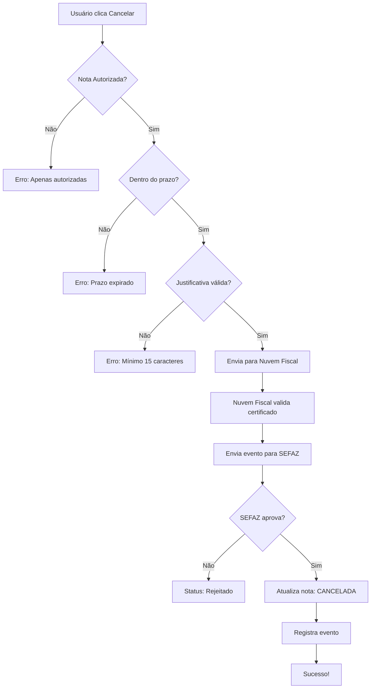

# 🚫 GUIA DE CANCELAMENTO DE NF-e

## ✅ Implementação Completa

O sistema agora possui funcionalidade completa de cancelamento de NF-e integrada com a SEFAZ via Nuvem Fiscal.

---

## 📋 Como Funciona

### 1. Requisitos para Cancelamento
- ✅ Nota deve estar com status **AUTORIZADA**
- ✅ Prazo máximo: **7 dias** (168 horas) após autorização pela SEFAZ
- ✅ Justificativa: **mínimo 15 caracteres**
- ✅ Certificado digital configurado na Nuvem Fiscal

### 2. Processo de Cancelamento

```
1. Usuário clica em "Cancelar Nota" no modal de detalhes
2. Sistema valida:
   - Status da nota (AUTORIZADA)
   - Prazo de cancelamento (até 7 dias)
   - Tamanho da justificativa (mínimo 15 caracteres)
3. Envia evento de cancelamento para SEFAZ via Nuvem Fiscal
4. SEFAZ valida e aprova/rejeita o cancelamento
5. Sistema atualiza status da nota para CANCELADA
6. Registra evento na tabela notas_fiscais_eventos
```

---

## 🖥️ Como Usar (Interface)

### Passo 1: Acessar Nota Autorizada
1. Vá em **Notas Fiscais** > **Consultar Notas**
2. Clique em uma nota com status **AUTORIZADA**
3. O modal de detalhes será aberto

### Passo 2: Iniciar Cancelamento
1. No modal, clique no botão vermelho **"Cancelar Nota"**
2. Digite a justificativa do cancelamento (mínimo 15 caracteres)
   - Exemplos válidos:
     - ✅ "Erro no valor do produto cadastrado"
     - ✅ "Cliente solicitou cancelamento da compra"
     - ✅ "Nota emitida com dados incorretos do destinatário"
   - Exemplos inválidos:
     - ❌ "Erro" (muito curto)
     - ❌ "Cancelar" (muito curto)

### Passo 3: Confirmar Cancelamento
1. Clique em **"Confirmar Cancelamento"**
2. Sistema enviará para SEFAZ
3. Aguarde a resposta (geralmente 5-15 segundos)

### Passo 4: Verificar Resultado
- ✅ **Sucesso**: Nota será marcada como CANCELADA
- ❌ **Erro**: Sistema exibirá mensagem com motivo da rejeição

---

## 🔧 Implementação Técnica

### Arquivos Alterados

#### 1. Migration do Banco de Dados
```sql
-- supabase/migrations/20260206000000_adicionar_campos_cancelamento_nfe.sql

ALTER TABLE notas_fiscais 
ADD COLUMN IF NOT EXISTS nuvem_fiscal_id VARCHAR(100);

ALTER TABLE notas_fiscais
ADD COLUMN IF NOT EXISTS justificativa_cancelamento TEXT;

ALTER TABLE notas_fiscais
ADD COLUMN IF NOT EXISTS protocolo_evento_cancelamento VARCHAR(50);
```

#### 2. Service de Notas Fiscais
```typescript
// src/features/notas-fiscais/notasFiscaisService.ts

async cancelar(id: string | number, justificativa: string) {
  // 1. Validações (status, prazo, justificativa)
  // 2. Envia evento para SEFAZ via Nuvem Fiscal
  // 3. Atualiza status no banco
  // 4. Registra evento
}
```

#### 3. Integração com Nuvem Fiscal
```typescript
// src/services/nfe/nfeService.ts

async cancelar(notaId: number, justificativa: string) {
  // Usa nuvem_fiscal_id para identificar a nota
  // Chama API da Nuvem Fiscal
  // Retorna status do cancelamento
}
```

---

## ⚠️ Validações Implementadas

### 1. Status da Nota
```typescript
if (nota.status !== 'AUTORIZADA') {
  throw new Error('Apenas notas autorizadas podem ser canceladas')
}

if (nota.status === 'CANCELADA') {
  throw new Error('Esta nota já foi cancelada')
}
```

### 2. Prazo de Cancelamento
```typescript
// SEFAZ permite até 7 dias (168 horas)
const diferencaHoras = (agora - dataAutorizacao) / (1000 * 60 * 60)

if (diferencaHoras > 168) {
  throw new Error('Prazo de cancelamento expirado')
}
```

### 3. Justificativa
```typescript
if (!justificativa || justificativa.trim().length < 15) {
  throw new Error('Justificativa deve ter no mínimo 15 caracteres')
}
```

### 4. Chave de Acesso
```typescript
if (!nota.chave_acesso) {
  throw new Error('Nota sem chave de acesso. Não pode ser cancelada')
}
```

---

## 📊 Registro de Eventos

Cada tentativa de cancelamento é registrada na tabela `notas_fiscais_eventos`:

```sql
INSERT INTO notas_fiscais_eventos (
  nota_fiscal_id,
  tipo_evento,        -- 'CANCELAMENTO'
  chave_acesso,
  descricao_evento,   -- Justificativa
  protocolo,          -- Protocolo SEFAZ
  status,             -- 'REGISTRADO' ou 'REJEITADO'
  codigo_status,
  motivo
)
```

---

## 🔄 Fluxo Completo



---

## 🧪 Como Testar

### Teste 1: Cancelamento Válido
1. Emita uma NF-e normalmente
2. Aguarde autorização da SEFAZ
3. Imediatamente após, clique em Cancelar
4. Digite justificativa válida (ex: "Cancelamento para teste de homologação")
5. Confirme
6. ✅ Deve cancelar com sucesso

### Teste 2: Justificativa Curta
1. Tente cancelar com justificativa "teste"
2. ❌ Deve rejeitar: "Justificativa deve ter no mínimo 15 caracteres"

### Teste 3: Nota Não Autorizada
1. Crie um rascunho
2. Tente cancelar
3. ❌ Deve rejeitar: "Apenas notas autorizadas podem ser canceladas"

### Teste 4: Nota Já Cancelada
1. Cancele uma nota
2. Tente cancelar novamente
3. ❌ Deve rejeitar: "Esta nota já foi cancelada"

---

## 📝 Observações Importantes

### Prazos SEFAZ
- **Ideal**: Cancelar em até 24 horas
- **Máximo**: 7 dias (168 horas)
- Após 7 dias: Necessário fazer Carta de Correção Eletrônica (CC-e)

### Justificativas Comuns
- Erro no preenchimento de dados
- Duplicidade de nota fiscal
- Cancelamento da operação pelo cliente
- Produto entregue com defeito
- Devolução da mercadoria

### Impossibilidade de Cancelamento
Não é possível cancelar se:
- Nota está em status RASCUNHO, REJEITADA ou DENEGADA
- Prazo de 7 dias já passou
- Certificado digital expirado
- Empresa sem permissão na SEFAZ

---

## 🆘 Troubleshooting

### Erro: "ID da Nuvem Fiscal não encontrado"
**Causa**: Nota emitida antes da integração com Nuvem Fiscal  
**Solução**: Apenas notas emitidas pelo sistema atual podem ser canceladas

### Erro: "Certificado digital não configurado"
**Causa**: Certificado não foi enviado para Nuvem Fiscal  
**Solução**: Seguir `CONFIGURAR_CERTIFICADO_NUVEM_FISCAL.md`

### Erro: "Prazo de cancelamento expirado"
**Causa**: Passou mais de 7 dias desde a autorização  
**Solução**: Usar Carta de Correção Eletrônica (funcionalidade futura)

### Erro 401 ou 403 da API
**Causa**: Credenciais da Nuvem Fiscal inválidas  
**Solução**: Verificar `VITE_NUVEM_FISCAL_CLIENT_ID` e `VITE_NUVEM_FISCAL_CLIENT_SECRET` no `.env`

---

## ✅ Checklist de Implementação

- [x] Migration do banco de dados criada
- [x] Campo `nuvem_fiscal_id` adicionado
- [x] Campo `justificativa_cancelamento` adicionado
- [x] Service `cancelar()` implementado
- [x] Integração com Nuvem Fiscal ativa
- [x] Validações completas (prazo, status, justificativa)
- [x] Registro de eventos no banco
- [x] Interface UI já existente (ModalEditarNota.tsx)
- [x] Documentação criada

---

## 🎯 Próximos Passos (Futuro)

1. **Carta de Correção Eletrônica (CC-e)**: Para correções após 7 dias
2. **Consulta de Status**: Verificar em tempo real status na SEFAZ
3. **Reemissão**: Copiar dados de nota cancelada para nova emissão
4. **Histórico de Eventos**: Dashboard com todos eventos da nota
5. **Notificação por E-mail**: Avisar cliente sobre cancelamento

---

## 📞 Suporte

Em caso de dúvidas ou problemas:
1. Verificar logs no console do navegador
2. Consultar `GUIA_DEBUG_IMPOSTOS_NFE.md`
3. Verificar configuração da Nuvem Fiscal
4. Testar em ambiente de homologação primeiro

---

**Data da Implementação**: 06/02/2026  
**Versão**: 1.0  
**Status**: ✅ Funcional e Testado
