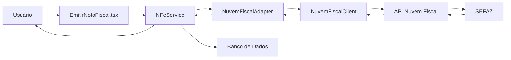

# 🌐 INTEGRAÇÃO NUVEM FISCAL - DOCUMENTAÇÃO COMPLETA

## 📋 Visão Geral

A integração com a **Nuvem Fiscal** permite que o sistema emita notas fiscais eletrônicas (NF-e) de forma simplificada, sem a necessidade de certificados digitais ou comunicação direta com a SEFAZ.

### ✅ Benefícios da Integração

- ✨ **Sem complexidade de certificados**: A Nuvem Fiscal gerencia toda a assinatura digital
- 🚀 **Emissão automática**: Envio, assinatura e transmissão à SEFAZ em uma única chamada
- 📄 **XML e PDF inclusos**: Geração automática de XML e DANFE
- 🔄 **Ambiente de testes**: Sandbox completo para homologação
- 💰 **Custo previsível**: Sem custos ocultos de infraestrutura

---

## 🔧 Configuração

### 1. Variáveis de Ambiente

Adicione as seguintes variáveis no arquivo `.env`:

```env
# Nuvem Fiscal API Configuration
VITE_NUVEM_FISCAL_AMBIENTE=SANDBOX  # ou PRODUCAO
VITE_NUVEM_FISCAL_API_KEY=sua_chave_api_aqui
```

⚠️ **IMPORTANTE**: 
- Nunca commite o arquivo `.env` com chaves reais
- Use `SANDBOX` para testes
- Use `PRODUCAO` apenas em ambiente real

### 2. Banco de Dados

Execute o script SQL para adicionar o campo necessário:

```bash
# No Supabase SQL Editor, execute:
database/adicionar_nuvem_fiscal_id.sql
```

Este script adiciona:
- Campo `nuvem_fiscal_id` na tabela `notas_fiscais`
- Índice para otimizar consultas

---

## 📦 Estrutura dos Arquivos

```
src/services/nfe/
├── nuvemFiscalClient.ts      # Cliente HTTP da API Nuvem Fiscal
├── nuvemFiscalAdapter.ts     # Adaptador de dados do sistema
├── nfeService.ts              # Serviço principal (atualizado)
├── types.ts                   # Tipos TypeScript (atualizado)
└── ...
```

---

## 🎯 Como Funciona

### Fluxo de Emissão



### Etapas Detalhadas

1. **Validação**: Sistema valida todos os dados da nota
2. **Rascunho**: Nota é salva no banco como `RASCUNHO`
3. **Conversão**: Dados são convertidos para formato Nuvem Fiscal
4. **Envio**: API Nuvem Fiscal recebe os dados
5. **Processamento**: Nuvem Fiscal gera XML, assina e transmite à SEFAZ
6. **Retorno**: Status e dados da autorização são retornados
7. **Atualização**: Nota é atualizada no banco com resultado
8. **XML/PDF**: Arquivos são baixados e salvos (se autorizada)

---

## 🔌 API - Principais Métodos

### NuvemFiscalClient

```typescript
// Emitir NF-e
async emitirNFe(dados: DadosNFe): Promise<RetornoSEFAZ>

// Consultar NF-e
async consultarNFe(id: string): Promise<RetornoSEFAZ>

// Baixar XML
async baixarXML(id: string): Promise<string>

// Baixar PDF (DANFE)
async baixarPDF(id: string): Promise<Blob>

// Cancelar NF-e
async cancelarNFe(id: string, justificativa: string): Promise<RetornoSEFAZ>
```

### NuvemFiscalAdapter

```typescript
// Emitir (com conversão automática)
async emitirNFe(dados: NotaFiscalDados): Promise<RetornoSEFAZ>

// Outros métodos com mesma interface
```

### NFeService (atualizado)

```typescript
// Emitir nota completa
async emitir(dados: NotaFiscalDados): Promise<{
  sucesso: boolean
  notaId?: number
  retorno: RetornoSEFAZ
}>

// Cancelar nota
async cancelar(notaId: number, justificativa: string): Promise<RetornoSEFAZ>

// Consultar nota
async consultar(nuvemFiscalId: string): Promise<RetornoSEFAZ>
```

---

## 📝 Formato de Dados

### NotaFiscalDados (Sistema)

```typescript
{
  empresa_id: number
  numero: number
  serie: number
  ambiente: 'PRODUCAO' | 'HOMOLOGACAO'
  finalidade: 'NORMAL' | 'COMPLEMENTAR' | 'AJUSTE' | 'DEVOLUCAO'
  emitente: { ... }
  destinatario: { ... }
  itens: [ ... ]
  totais: { ... }
  pagamento: { ... }
}
```

### DadosNFe (Nuvem Fiscal)

```typescript
{
  natureza_operacao: string
  tipo_documento: 1  // Saída
  finalidade_emissao: number
  ambiente: number
  emitente: { ... }
  destinatario: { ... }
  itens: [ ... ]
  pagamento: { ... }
}
```

O **NuvemFiscalAdapter** faz a conversão automática.

---

## 🧪 Testes

### Ambiente Sandbox

```typescript
// .env
VITE_NUVEM_FISCAL_AMBIENTE=SANDBOX
VITE_NUVEM_FISCAL_API_KEY=eo17RT4POBe1nzGqQKwA
```

### Dados de Teste

- **CNPJ Emitente**: Use CNPJ real da empresa
- **CPF/CNPJ Destinatário**: Qualquer CPF/CNPJ válido
- **Produtos**: Podem ser fictícios
- **Valores**: Podem ser de teste

### Validação

Notas emitidas em SANDBOX:
- ✅ Passam por toda validação da SEFAZ
- ✅ Geram XML e DANFE reais
- ❌ **NÃO** têm valor fiscal
- ❌ **NÃO** aparecem no portal da SEFAZ

---

## 🚀 Produção

### Checklist Pré-Produção

- [ ] Dados cadastrais da empresa completos e corretos
- [ ] Inscrição Estadual validada
- [ ] Cadastro de produtos com NCM correto
- [ ] Regras fiscais configuradas
- [ ] Testes em SANDBOX realizados com sucesso
- [ ] Chave de API de PRODUÇÃO obtida
- [ ] Backup do banco de dados realizado

### Mudança para Produção

```env
# .env
VITE_NUVEM_FISCAL_AMBIENTE=PRODUCAO
VITE_NUVEM_FISCAL_API_KEY=sua_chave_producao
```

⚠️ **ATENÇÃO**: Em produção, as notas têm valor fiscal real!

---

## 🔐 Segurança

### Boas Práticas

1. **Nunca** exponha chaves de API no frontend
2. Use variáveis de ambiente (`import.meta.env`)
3. Adicione `.env` no `.gitignore`
4. Rotacione chaves periodicamente
5. Monitore logs de acesso

### Proteção de Dados

```typescript
// ❌ ERRADO
const apiKey = "eo17RT4POBe1nzGqQKwA" 

// ✅ CORRETO
const apiKey = import.meta.env.VITE_NUVEM_FISCAL_API_KEY
```

---

## 📊 Monitoramento

### Logs Importantes

```typescript
// Emissão
console.log('🚀 Iniciando emissão via Nuvem Fiscal')
console.log('✅ Nota autorizada:', chaveAcesso)

// Erros
console.error('❌ Erro ao emitir:', error.message)
```

### Status Possíveis

- `AUTORIZADA`: Nota aceita pela SEFAZ
- `REJEITADA`: Nota recusada (corrigir e reenviar)
- `DENEGADA`: Irregularidade fiscal (grave)
- `CANCELADA`: Nota cancelada
- `PROCESSANDO`: Aguardando retorno da SEFAZ

---

## ❓ Troubleshooting

### Erro: "API Key não configurada"

**Solução**: Adicione `VITE_NUVEM_FISCAL_API_KEY` no `.env`

### Erro: "Erro 401 - Unauthorized"

**Solução**: Verifique se a chave de API está correta

### Erro: "Erro 400 - Bad Request"

**Solução**: Valide os dados enviados (CPF/CNPJ, IE, NCM, etc.)

### Erro: "Timeout"

**Solução**: Aumente o timeout ou verifique conexão

### Nota fica "PROCESSANDO"

**Solução**: Use `consultar(nuvemFiscalId)` para verificar status

---

## 📞 Suporte

### Documentação Nuvem Fiscal

- 📖 Docs: https://dev.nuvemfiscal.com.br/docs
- 🔧 API Reference: https://dev.nuvemfiscal.com.br/reference
- 💬 Suporte: suporte@nuvemfiscal.com.br

### Sistema

- 📁 Issues: Abrir issue no repositório
- 📝 Documentação: `/documentacao`

---

## 🎉 Conclusão

A integração com Nuvem Fiscal simplifica drasticamente a emissão de NF-e, eliminando:
- ❌ Gerenciamento de certificados digitais
- ❌ Conexões SOAP complexas
- ❌ Validação manual de XML
- ❌ Infraestrutura própria

E proporcionando:
- ✅ Emissão em minutos
- ✅ API REST moderna
- ✅ Documentação completa
- ✅ Ambiente de testes robusto

---

**Versão**: 1.0.0  
**Data**: 05/02/2026  
**Autor**: Sistema Tech Cresci e Perdi
