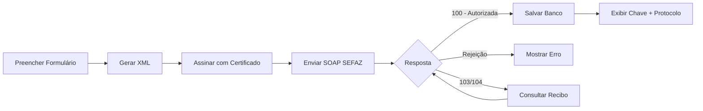

# 🚀 PRÓXIMOS PASSOS - Você já tem certificado!

## Status: PRONTO PARA TESTE ✅

Você já possui certificado digital, então vamos direto aos passos práticos para começar a emitir notas.

---

## FASE 1: CONFIGURAR CERTIFICADO NO SISTEMA (5 minutos)

### 1.1 Aplicar campos no banco de dados

Execute este SQL no Supabase:

```sql
-- Adicionar campos de certificado na tabela empresas
ALTER TABLE empresas 
  ADD COLUMN IF NOT EXISTS certificado_digital BYTEA,
  ADD COLUMN IF NOT EXISTS certificado_senha TEXT,
  ADD COLUMN IF NOT EXISTS certificado_validade DATE,
  ADD COLUMN IF NOT EXISTS certificado_cnpj TEXT;

COMMENT ON COLUMN empresas.certificado_digital IS 'Arquivo .pfx do certificado A1 (criptografado)';
COMMENT ON COLUMN empresas.certificado_senha IS '⚠️ CRIPTOGRAFAR! Senha do certificado';
COMMENT ON COLUMN empresas.certificado_validade IS 'Data de validade do certificado';
COMMENT ON COLUMN empresas.certificado_cnpj IS 'CNPJ do certificado (validação)';
```

### 1.2 Upload do certificado

1. Acesse **Nota Fiscal > Parâmetros Fiscais**
2. Vá na aba **"Certificado Digital"**
3. Selecione seu arquivo `.pfx` ou `.p12`
4. Digite a senha do certificado
5. Clique em **"Validar e Salvar Certificado"**

O sistema irá:
- ✅ Validar a assinatura digital
- ✅ Verificar a data de validade
- ✅ Extrair o CNPJ
- ✅ Salvar no banco de dados

---

## FASE 2: PREPARAR AMBIENTE DE HOMOLOGAÇÃO (10 minutos)

### 2.1 Configurar variáveis de ambiente

Edite o arquivo `.env` e deixe **VAZIO** o token da Focus NFe:

```env
# ==========================================
# NF-e - MODO GRATUITO (Direto SEFAZ)
# ==========================================

# ⚠️ Deixe VAZIO para usar modo gratuito
VITE_FOCUS_NFE_TOKEN_HOMOLOGACAO=
VITE_FOCUS_NFE_TOKEN_PRODUCAO=

# Ambiente padrão
VITE_NFE_AMBIENTE=HOMOLOGACAO
```

### 2.2 Configurar dados de empresa para homologação

Na tela de **Cadastro > Empresa**, preencha:

**Dados OBRIGATÓRIOS:**
- CNPJ: `seu CNPJ real` (mesmo do certificado)
- Razão Social: Sua razão social
- Nome Fantasia: Seu nome fantasia
- Inscrição Estadual: `sua IE real`
- Regime Tributário: Selecione o correto
- UF: Estado da empresa
- Código Município: Código IBGE do município

**Dados Fiscais:**
- Série NF-e: 1
- Ambiente NF-e: **HOMOLOGAÇÃO**
- Empresa Padrão NF-e: ✅ SIM

---

## FASE 3: EMITIR PRIMEIRA NOTA DE TESTE (15 minutos)

### 3.1 Dados do cliente para homologação

Na tela de **Emitir Nota Fiscal**, use este cliente de teste:

```
Nome/Razão: NF-E EMITIDA EM AMBIENTE DE HOMOLOGACAO - SEM VALOR FISCAL
CPF: 111.111.111-91
Endereço: RUA TESTE, 123
Bairro: CENTRO
Cidade: São Paulo - SP
CEP: 01310-100
```

### 3.2 Produto de teste

```
Descrição: NOTA FISCAL EMITIDA EM AMBIENTE DE HOMOLOGACAO - SEM VALOR FISCAL
NCM: 00000000 (genérico para teste)
CFOP: 5102 (Venda mercadoria adquirida)
Quantidade: 1
Valor Unitário: 10,00
Valor Total: 10,00
```

### 3.3 Impostos (mínimo necessário)

```
ICMS:
- CST: 00 (Tributada integralmente)
- BC ICMS: 10,00
- Alíquota: 18%
- Valor ICMS: 1,80

PIS:
- CST: 01 (Operação Tributável)
- BC: 10,00
- Alíquota: 1,65%
- Valor: 0,17

COFINS:
- CST: 01 (Operação Tributável)
- BC: 10,00
- Alíquota: 7,6%
- Valor: 0,76
```

### 3.4 Emitir nota

1. Preencha todos os campos
2. Clique em **"Emitir Nota Fiscal"**
3. Aguarde o processamento (30-60 segundos)
4. Observe os logs no console do navegador (F12)

**Resultado esperado:**
```
✅ Nota fiscal autorizada!
Chave de Acesso: 35240112345678000190550010000000011000000015
Protocolo: 123456789012345
```

---

## FASE 4: SOLUÇÃO DE PROBLEMAS COMUNS

### Erro: "Certificado expirado"
**Solução:** Seu certificado venceu. Renove junto à Certificadora.

### Erro: "Rejeição 203 - CNPJ do emitente não cadastrado"
**Solução:** 
1. Verifique se o CNPJ da empresa está correto
2. Certifique-se que o certificado é do mesmo CNPJ
3. Em homologação, alguns CNPJs podem não funcionar

### Erro: "Timeout na comunicação"
**Solução:**
1. Verifique sua conexão com internet
2. SEFAZ pode estar instável (tente novamente)
3. Firewall pode estar bloqueando

### Erro: "Rejeição 539 - CFOP não permitido"
**Solução:** Use CFOP correto para a operação (5102 para venda interna)

### Erro: "Rejeição 564 - NCM inexistente"
**Solução:** Use NCM válido conforme tabela da Receita

---

## FASE 5: PRODUÇÃO (Quando estiver confiante)

### 5.1 Configurar ambiente

Edite `.env`:
```env
VITE_NFE_AMBIENTE=PRODUCAO
```

### 5.2 Atualizar empresa

Na tela de Empresa, altere:
- Ambiente NF-e: **PRODUÇÃO**

### 5.3 ⚠️ ATENÇÃO PRODUÇÃO

- Notas em produção têm **VALOR FISCAL LEGAL**
- Não pode cancelar após 24h
- Erros vão para sua pendência na SEFAZ
- Certifique-se de testar TUDO em homologação primeiro

---

## FLUXO TÉCNICO (O que acontece por trás)



---

## CUSTOS DO MODO GRATUITO

| Item | Custo Anual | Obrigatório |
|------|-------------|-------------|
| Certificado A1 | R$ 150-250 | ✅ SIM (legal) |
| API Intermediária | R$ 0 | ❌ NÃO |
| **TOTAL** | **R$ 150-250** | - |

**Economia vs API paga:** R$ 148 - 988/ano

---

## CHECKLIST FINAL

Antes de emitir em produção, confirme:

- [ ] Certificado válido e carregado no sistema
- [ ] Dados da empresa 100% corretos (CNPJ, IE, endereço)
- [ ] Série de NF-e definida (ex: 1)
- [ ] Cadastro de NCM completo e correto
- [ ] Cadastro de CFOP com operações fiscais
- [ ] Regras de tributação configuradas por produto
- [ ] Testado em homologação com sucesso
- [ ] Cliente real com CPF/CNPJ válido
- [ ] Produtos com valores corretos
- [ ] Impostos calculados corretamente

---

## SUPORTE

**Documentação completa:**
- [MODO_GRATUITO_NFE.md](./MODO_GRATUITO_NFE.md) - Guia técnico completo
- [README_INTEGRACAO_NFE.md](./README_INTEGRACAO_NFE.md) - Referência técnica

**Logs úteis:**
- Abra o Console do navegador (F12)
- Veja logs com emoji 🔐 (certificado), 📤 (envio), ✅ (sucesso)
- Erros aparecem com detalhes do código SEFAZ

**Contatos SEFAZ:**
- SP: (11) 2930-5555
- Documentação: https://www.nfe.fazenda.gov.br/

---

## 🎯 PRÓXIMO PASSO IMEDIATO

1. Execute o SQL acima no Supabase
2. Faça upload do seu certificado
3. Tente emitir a nota de teste

**Você está a 3 passos de emitir sua primeira nota fiscal! 🚀**
