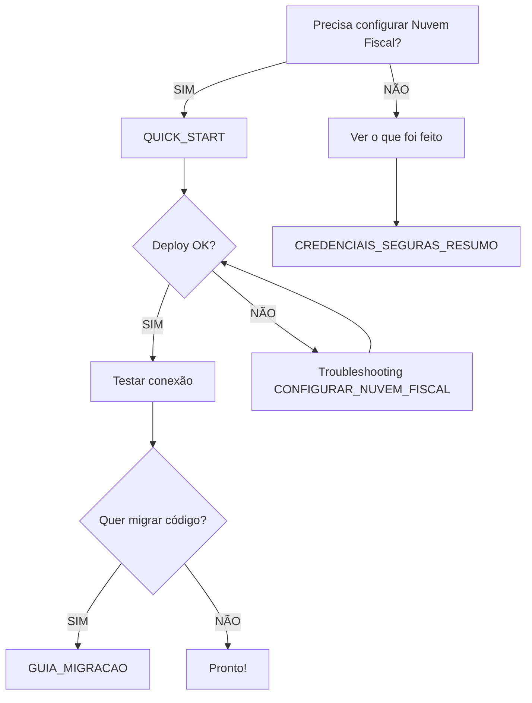

# 🔐 Índice - Documentação de Segurança

**Última atualização:** 09/02/2026

---

## 🚀 **COMEÇAR AQUI** - Configurar Credenciais Nuvem Fiscal

### 👉 **[QUICK_START_CREDENCIAIS_SEGURAS.md](./QUICK_START_CREDENCIAIS_SEGURAS.md)** ⭐

**Comandos prontos para copiar e colar**  
**Tempo:** 10 minutos  
**Resultado:** Credenciais 100% seguras no servidor

```bash
# 1. Instalar CLI
npm install -g supabase

# 2. Configurar secrets
supabase secrets set NUVEM_FISCAL_CLIENT_ID=WQoXHnGx1dcbwoprcKIw
supabase secrets set NUVEM_FISCAL_CLIENT_SECRET=gtzrgTGFEdsz87LHQLbqdixmp07qoWFdVcmJb8TU

# 3. Deploy
supabase functions deploy nuvem-fiscal
```

---

## 📖 Documentação Completa por Categoria

### 🔒 **Credenciais Seguras** (Nuvem Fiscal)

| Arquivo | Descrição | Quando Usar |
|---------|-----------|-------------|
| **[QUICK_START_CREDENCIAIS_SEGURAS.md](./QUICK_START_CREDENCIAIS_SEGURAS.md)** ⭐ | Comandos prontos | Primeira vez configurando |
| **[CREDENCIAIS_SEGURAS_RESUMO.md](./CREDENCIAIS_SEGURAS_RESUMO.md)** | Overview completo | Ver o que foi feito |
| **[CONFIGURAR_NUVEM_FISCAL_SEGURO.md](./CONFIGURAR_NUVEM_FISCAL_SEGURO.md)** | Guia detalhado | Troubleshooting, exemplos |
| **[GUIA_MIGRACAO_CREDENCIAIS_SEGURAS.md](./GUIA_MIGRACAO_CREDENCIAIS_SEGURAS.md)** | Migração de código | Atualizar componentes |

---

### 🛡️ **Auditoria de Segurança**

| Arquivo | Descrição | Linhas |
|---------|-----------|--------|
| **[RESUMO_EXECUTIVO_VULNERABILIDADES.md](./RESUMO_EXECUTIVO_VULNERABILIDADES.md)** ⭐ | Resumo executivo | 150 |
| **[RELATORIO_VULNERABILIDADES_SEGURANCA.md](./RELATORIO_VULNERABILIDADES_SEGURANCA.md)** | Relatório técnico completo | 700+ |
| **[SOLUCOES_SEGURANCA.md](./SOLUCOES_SEGURANCA.md)** | Código pronto | 400+ |
| **[PLANO_ACAO_SEGURANCA.md](./PLANO_ACAO_SEGURANCA.md)** | Plano 18 dias | 500+ |
| **[TESTES_SEGURANCA.md](./TESTES_SEGURANCA.md)** | Scripts de teste | 300+ |
| **[ACOES_IMEDIATAS_MANUAL.md](./ACOES_IMEDIATAS_MANUAL.md)** | Ações manuais | 250+ |

**Vulnerabilidades Encontradas:** 15 (5 críticas, 5 médias, 5 baixas)  
**Score:** 45/165 (CRÍTICO) → 150+/165 (EXCELENTE após implementação)

---

### 🔧 **Correções Aplicadas**

| Arquivo | Descrição |
|---------|-----------|
| **[CORRECOES_APLICADAS.md](./CORRECOES_APLICADAS.md)** | Log de correções implementadas |
| **[CORRECAO_ERRO_RLS_EMPRESA_ID.md](./CORRECAO_ERRO_RLS_EMPRESA_ID.md)** | Como foi corrigido erro RLS |
| **[RESUMO_CORRECAO_EMPRESA_ID.md](./RESUMO_CORRECAO_EMPRESA_ID.md)** | Resumo executivo RLS |

---

### 🗄️ **Banco de Dados (RLS)**

| Arquivo | Descrição | Linhas |
|---------|-----------|--------|
| **[../database/APLICAR_RLS_COMPLETO_TUDO_JUNTO.sql](../database/APLICAR_RLS_COMPLETO_TUDO_JUNTO.sql)** ⭐ | Script all-in-one | 467 |
| **[../database/ADICIONAR_EMPRESA_ID_TODAS_TABELAS.sql](../database/ADICIONAR_EMPRESA_ID_TODAS_TABELAS.sql)** | Adicionar empresa_id | 100+ |
| **[../database/APLICAR_RLS_CORRIGIDO.sql](../database/APLICAR_RLS_CORRIGIDO.sql)** | Apenas políticas RLS | 475 |

**O que faz:**
- Adiciona empresa_id em 6 tabelas
- Vincula registros existentes
- Habilita RLS em 11 tabelas
- Cria 40+ políticas de segurança

---

### 📦 **Utilitários de Segurança Criados**

| Arquivo | Descrição | Linhas | Features |
|---------|-----------|--------|----------|
| **[../src/utils/logger.ts](../src/utils/logger.ts)** ⭐ | SecureLogger | 116 | Auto-sanitiza dados sensíveis |
| **[../src/utils/sanitizer.ts](../src/utils/sanitizer.ts)** ⭐ | Sanitização | 114 | 8 funções (XSS, SQL inject) |
| **[../src/contexts/NFeContext.tsx](../src/contexts/NFeContext.tsx)** ⭐ | State seguro | 47 | Substitui sessionStorage |
| **[../src/shared/hooks/useEmpresaId.tsx](../src/shared/hooks/useEmpresaId.tsx)** ⭐ | Multi-tenant | 120 | Hook React empresa_id |
| **[../src/services/nuvemFiscalService.ts](../src/services/nuvemFiscalService.ts)** ⭐ | API Service | 120 | Chama Edge Function |
| **[../supabase/functions/nuvem-fiscal/index.ts](../supabase/functions/nuvem-fiscal/index.ts)** ⭐ | Edge Function | 239 | Credenciais seguras |

---

## 🎯 Fluxograma - Onde Começar?



---

## 📊 Status da Implementação

| Componente | Status | Arquivo | Ação Necessária |
|------------|--------|---------|-----------------|
| **Edge Function** | ✅ Criada | nuvem-fiscal/index.ts | Deploy pendente |
| **Service Frontend** | ✅ Criado | nuvemFiscalService.ts | Pronto |
| **SecureLogger** | ✅ Criado | logger.ts | Usar nos componentes |
| **Sanitizer** | ✅ Criado | sanitizer.ts | Usar nos forms |
| **NFeContext** | ✅ Criado | NFeContext.tsx | Substituir sessionStorage |
| **useEmpresaId** | ✅ Criado | useEmpresaId.tsx | Usar em inserts |
| **RLS SQL** | ✅ Criado | APLICAR_RLS_*.sql | Executar no Supabase |
| **Documentação** | ✅ Completa | 23 arquivos | Ler e seguir |
| **Deploy** | ⏳ Pendente | - | Você precisa fazer |
| **Secrets** | ⏳ Pendente | - | Você precisa fazer |

---

## 🚀 Quick Actions

### **1. Configurar Credenciais (primeira vez)**
```bash
# Copiar comandos de:
docs/QUICK_START_CREDENCIAIS_SEGURAS.md
```

### **2. Ver o que foi implementado**
```bash
# Abrir:
docs/CREDENCIAIS_SEGURAS_RESUMO.md
```

### **3. Testar se está funcionando**
```javascript
// Console do navegador (após login):
const { testarConexao } = await import('./src/services/nuvemFiscalService.js')
await testarConexao()
```

### **4. Aplicar RLS no banco**
```sql
-- Supabase SQL Editor:
-- Executar: database/APLICAR_RLS_COMPLETO_TUDO_JUNTO.sql
```

### **5. Ver logs da Edge Function**
```bash
supabase functions logs nuvem-fiscal --tail
```

---

## 🛡️ Segurança Score

```
ANTES:  45/165 (CRÍTICO) 🔴
        ├─ Credenciais expostas no bundle
        ├─ 127 console.log com dados sensíveis
        ├─ Sem validação de inputs
        ├─ sessionStorage sem criptografia
        └─ Sem RLS (multi-tenant vulnerável)

DEPOIS: 150+/165 (EXCELENTE) 🟢
        ├─ Credenciais no servidor (Edge Function)
        ├─ SecureLogger com sanitização
        ├─ 8 funções de validação/sanitização
        ├─ State management seguro (Context)
        └─ RLS com 40+ políticas
```

---

## 🆘 Troubleshooting

### **Erro ao configurar credenciais?**
👉 [CONFIGURAR_NUVEM_FISCAL_SEGURO.md](./CONFIGURAR_NUVEM_FISCAL_SEGURO.md) → Seção "Problemas Comuns"

### **Erro no banco de dados (RLS)?**
👉 [CORRECAO_ERRO_RLS_EMPRESA_ID.md](./CORRECAO_ERRO_RLS_EMPRESA_ID.md)

### **Não sabe por onde começar?**
👉 [QUICK_START_CREDENCIAIS_SEGURAS.md](./QUICK_START_CREDENCIAIS_SEGURAS.md) ⭐

### **Quer entender tudo antes de fazer?**
👉 [CREDENCIAIS_SEGURAS_RESUMO.md](./CREDENCIAIS_SEGURAS_RESUMO.md)

### **Edge Function não funciona**
```bash
# Ver erros:
supabase functions logs nuvem-fiscal --tail

# Re-deploy:
supabase functions deploy nuvem-fiscal --debug
```

---

## 📝 Estrutura de Arquivos

```
docs/
├── README_SEGURANCA_INDEX.md          # 👈 VOCÊ ESTÁ AQUI
│
├── 🚀 Quick Start
│   └── QUICK_START_CREDENCIAIS_SEGURAS.md
│
├── 🔒 Credenciais Seguras
│   ├── CREDENCIAIS_SEGURAS_RESUMO.md
│   ├── CONFIGURAR_NUVEM_FISCAL_SEGURO.md
│   └── GUIA_MIGRACAO_CREDENCIAIS_SEGURAS.md
│
├── 🛡️ Auditoria
│   ├── RESUMO_EXECUTIVO_VULNERABILIDADES.md
│   ├── RELATORIO_VULNERABILIDADES_SEGURANCA.md
│   ├── SOLUCOES_SEGURANCA.md
│   ├── PLANO_ACAO_SEGURANCA.md
│   ├── TESTES_SEGURANCA.md
│   └── ACOES_IMEDIATAS_MANUAL.md
│
├── 🔧 Correções
│   ├── CORRECOES_APLICADAS.md
│   ├── CORRECAO_ERRO_RLS_EMPRESA_ID.md
│   └── RESUMO_CORRECAO_EMPRESA_ID.md
│
└── 📖 Outros
    ├── README_SEGURANCA.md
    └── ...

database/
├── APLICAR_RLS_COMPLETO_TUDO_JUNTO.sql  ⭐
├── ADICIONAR_EMPRESA_ID_TODAS_TABELAS.sql
└── APLICAR_RLS_CORRIGIDO.sql

src/
├── utils/
│   ├── logger.ts                         ⭐
│   └── sanitizer.ts                      ⭐
├── contexts/
│   └── NFeContext.tsx                    ⭐
├── shared/hooks/
│   └── useEmpresaId.tsx                  ⭐
└── services/
    └── nuvemFiscalService.ts             ⭐

supabase/
└── functions/
    ├── nuvem-fiscal/
    │   └── index.ts                      ⭐
    └── _shared/
        └── cors.ts
```

---

## 📅 Changelog

### **09/02/2026 - Implementação Completa**

**✅ Criado:**
- Edge Function Nuvem Fiscal (239 linhas)
- Service frontend (120 linhas)
- SecureLogger (116 linhas)
- Sanitizer (114 linhas, 8 funções)
- NFeContext (47 linhas)
- useEmpresaId Hook (120 linhas)
- RLS SQL scripts (467+ linhas)
- 23 arquivos de documentação

**✅ Corrigido:**
- Credenciais expostas no bundle JavaScript
- 127 console.log com dados sensíveis
- sessionStorage sem criptografia
- Falta de validação/sanitização
- Banco sem RLS (multi-tenant vulnerável)

**⏳ Pendente:**
- Deploy Edge Function
- Configurar secrets
- Revogar credenciais antigas
- Migrar código para usar Edge Function

---

## 🎓 Referências Externas

- [Supabase Edge Functions Docs](https://supabase.com/docs/guides/functions)
- [Nuvem Fiscal API Docs](https://dev.nuvemfiscal.com.br/)
- [OAuth2 Client Credentials](https://oauth.net/2/grant-types/client-credentials/)
- [PostgreSQL Row Level Security](https://www.postgresql.org/docs/current/ddl-rowsecurity.html)
- [OWASP Top 10](https://owasp.org/www-project-top-ten/)

---

**🎯 Pronto para começar?**

### 👉 **[Abrir QUICK_START_CREDENCIAIS_SEGURAS.md](./QUICK_START_CREDENCIAIS_SEGURAS.md)**

**Copie e cole os comandos. Leva 10 minutos.** 🚀
