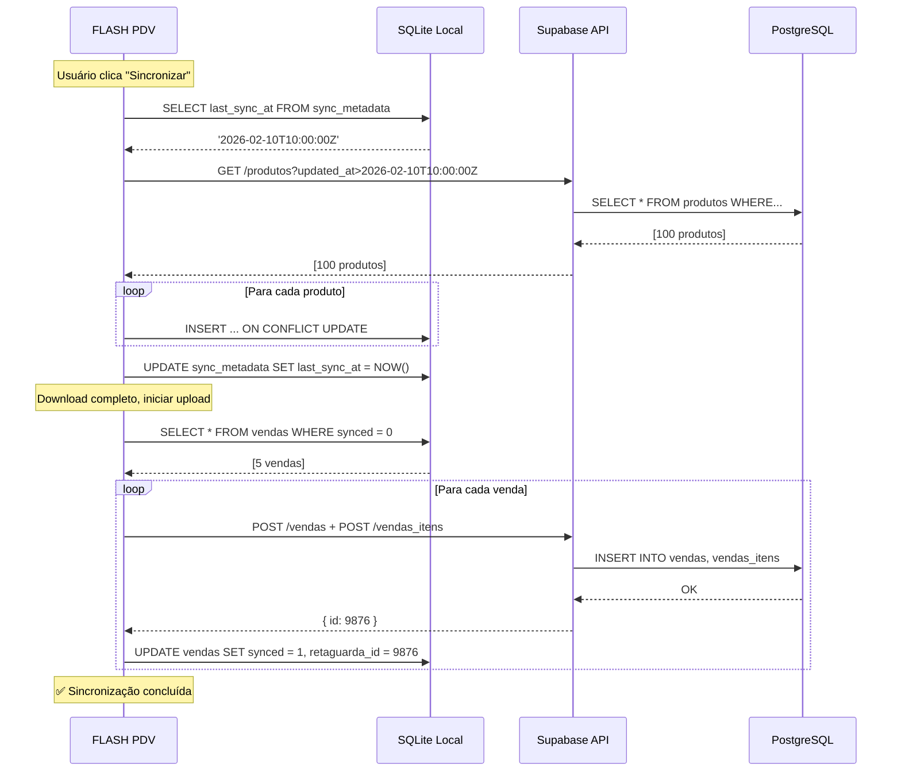

# 🔄 Integração FLASH PDV ↔ Retaguarda

## Visão Geral

O **FLASH PDV** é um sistema desktop offline que sincroniza dados com a retaguarda web (Supabase).

```
┌─────────────────┐         ┌──────────────────┐         ┌─────────────────┐
│   RETAGUARDA    │◄────────┤   SINCRONIZAÇÃO  │────────►│   FLASH PDV     │
│   (Supabase)    │         │   Bidirecional   │         │   (SQLite)      │
└─────────────────┘         └──────────────────┘         └─────────────────┘
     PostgreSQL                                                  Offline
     Multi-tenant                                            Single-tenant
```

## 🔽 Download (Retaguarda → PDV)

### Produtos
```typescript
// Sincroniza produtos ativos da empresa
SELECT * FROM produtos 
WHERE empresa_id = ? 
  AND ativo = true 
  AND updated_at > ?  -- Última sincronização

// Campos sincronizados:
- id, codigo, descricao
- preco_venda, estoque_atual
- ean13, ncm, cfop, cest
- origem_mercadoria
```

### Clientes
```typescript
// Sincroniza clientes ativos
SELECT * FROM clientes 
WHERE empresa_id = ? 
  AND ativo = true 
  AND updated_at > ?

// Campos sincronizados:
- id, codigo, nome_completo, razao_social
- cpf, cnpj, tipo_pessoa
- email, telefone
- cep, logradouro, numero, bairro, cidade, uf
```

### Configurações (Futuro)
- Parâmetros fiscais
- Formas de pagamento
- Certificado digital para NFC-e

## 🔼 Upload (PDV → Retaguarda)

### Vendas
```typescript
// Envia vendas realizadas no PDV
INSERT INTO vendas (
  empresa_id,
  numero_venda,
  cliente_id,
  data_venda,
  valor_total,
  desconto,
  valor_final,
  forma_pagamento,
  status,
  observacoes,
  usuario_id,
  origem  -- 'PDV'
) VALUES (...)

// Itens da venda
INSERT INTO vendas_itens (
  venda_id,
  produto_id,
  quantidade,
  preco_unitario,
  desconto,
  valor_total
) VALUES (...)
```

### Controle de Sincronização
```sql
-- Tabela local no SQLite
CREATE TABLE sync_metadata (
  table_name TEXT,
  last_sync_at TEXT,  -- ISO 8601 timestamp
  empresa_id INTEGER
);

-- Exemplo:
-- table_name: 'produtos', last_sync_at: '2026-02-10T15:30:00.000Z'
```

## 🔐 Autenticação

### Configuração Inicial (Primeira Execução)
```typescript
// config.json (armazenado localmente)
{
  "supabaseUrl": "https://xxx.supabase.co",
  "supabaseKey": "eyJhbGc...",  // Anon key
  "empresaId": 123,
  "usuarioId": 456,
  "nomeOperador": "João Silva"
}
```

### RLS (Row Level Security)
O PDV utiliza a mesma autenticação da retaguarda:
- Service key para sincronização (sem RLS)
- OU User token com permissões limitadas

## 📊 Estratégia de Sincronização

### Sincronização Incremental
```typescript
// 1. Verificar última sincronização
const lastSync = await getLastSyncTime('produtos')

// 2. Buscar apenas registros novos/alterados
const produtos = await supabase
  .from('produtos')
  .select('*')
  .eq('empresa_id', empresaId)
  .gt('updated_at', lastSync)

// 3. Atualizar banco local (UPSERT)
for (const prod of produtos) {
  await sqlite.run(`
    INSERT INTO produtos (id, codigo, descricao, ...)
    VALUES (?, ?, ?, ...)
    ON CONFLICT(id) DO UPDATE SET
      descricao = excluded.descricao,
      preco_venda = excluded.preco_venda,
      ...
  `)
}

// 4. Atualizar timestamp
await updateSyncTime('produtos', new Date())
```

### Resolução de Conflitos
- **Produtos/Clientes**: Retaguarda sempre vence (source of truth)
- **Vendas**: PDV sempre vence (criadas localmente)
- **Estoque**: Última atualização vence (timestamp)

## 🚨 Tratamento de Erros

### Vendas Não Sincronizadas
```sql
-- Marcar vendas com erro de sincronização
UPDATE vendas 
SET synced = 0, 
    sync_error = 'Erro de conexão'
WHERE id = ?

-- Na próxima sync, tentar novamente
SELECT * FROM vendas 
WHERE synced = 0 
  AND retry_count < 3
```

### Retry Strategy
1. Primeira tentativa: imediato
2. Segunda tentativa: após 5 minutos
3. Terceira tentativa: após 30 minutos
4. Alertar usuário: venda precisa sync manual

## 🔄 Fluxo Completo de Sincronização



## 📝 Campos Obrigatórios para Integração

### Tabela `produtos` (Retaguarda)
Devem ter `updated_at TIMESTAMP`:
```sql
ALTER TABLE produtos 
  ADD COLUMN IF NOT EXISTS updated_at TIMESTAMPTZ 
  DEFAULT NOW();

-- Trigger para atualizar automaticamente
CREATE OR REPLACE FUNCTION update_updated_at_column()
RETURNS TRIGGER AS $$
BEGIN
  NEW.updated_at = NOW();
  RETURN NEW;
END;
$$ language 'plpgsql';

CREATE TRIGGER update_produtos_updated_at 
  BEFORE UPDATE ON produtos
  FOR EACH ROW
  EXECUTE FUNCTION update_updated_at_column();
```

### Tabela `vendas` (Retaguarda)
Adicionar campo `origem`:
```sql
ALTER TABLE vendas 
  ADD COLUMN IF NOT EXISTS origem VARCHAR(20) DEFAULT 'WEB';

-- Valores: 'WEB', 'PDV', 'API', 'IMPORTACAO'
```

## 🎯 Próximos Passos

1. **Configuração RLS**
   - Criar policy para sincronização PDV
   - Service key ou user token?

2. **API Endpoints**
   - Criar função RPC para sync em lote
   - Reduzir número de requisições

3. **Compressão**
   - Gzip para payloads grandes
   - Enviar somente campos alterados

4. **Offline-first**
   - Queue de operações pendentes
   - Sincronização automática ao detectar internet

5. **Logs**
   - Registrar todas as sincronizações
   - Monitorar erros e performance

## 🔧 Configuração na Retaguarda

### 1. Criar Service Key para PDV
```sql
-- Usuário específico para sincronização PDV
INSERT INTO auth.users (email, role) 
VALUES ('pdv-sync@company.com', 'service_role');
```

### 2. Configurar Variáveis de Ambiente
```env
VITE_SUPABASE_URL=https://xxx.supabase.co
VITE_SUPABASE_ANON_KEY=eyJhbGc...
VITE_SUPABASE_SERVICE_KEY=eyJhbGc...  # Para PDV
```

### 3. Testar Integração
```bash
# No flash-pdv/
npm install
npm run dev

# Configurar empresa e credenciais
# Clicar em "Sincronizar"
# Verificar logs no console
```

## 📚 Referências

- [Supabase Client Documentation](https://supabase.com/docs/reference/javascript/introduction)
- [better-sqlite3 API](https://github.com/WiseLibs/better-sqlite3/blob/master/docs/api.md)
- [Electron IPC Communication](https://www.electronjs.org/docs/latest/tutorial/ipc)

---

**Última atualização:** 10/02/2026  
**Versão:** 1.0.0
